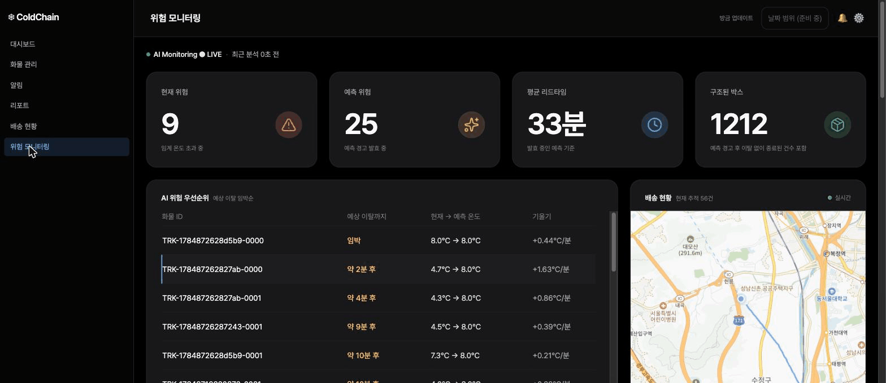
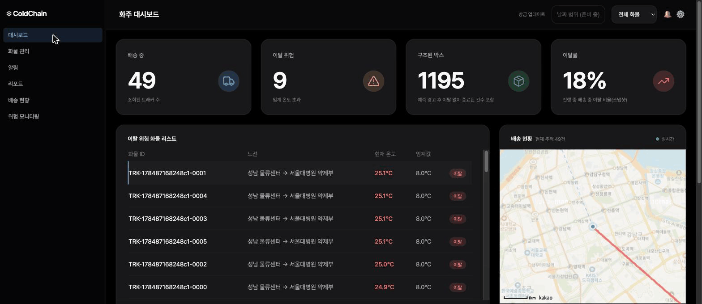

# 🧊 coldchain

**임계값을 넘은 뒤 알리는 관제가 아니라, 넘기 전에 경고하는 콜드체인 IoT 관제 시스템.**

[](https://github.com/younchanhyeok/coldchain/actions/workflows/ci.yml)


의약품·식품 콜드체인 배송은 온도가 임계를 벗어난 **후에** 알아채면 이미 화물을 버려야 한다. 이 프로젝트는 트래커(온도·위치) 데이터를 실시간 수집·이상탐지하는 것을 넘어, 현재 추세로부터 **온도 이탈을 사전에 예측**해 문제가 벌어지기 전에 경고한다. 예측이 무의미해지는 급변(냉동기 고장)에는 예측을 즉시 `INVALIDATED` 처리하고 확정 알림으로 전환한다 — **안전한 실패 설계**.



> 위험 모니터링 콘솔 — 각 화물의 예상 이탈 시각을 임박순으로 정렬하고, 예측 리드타임·구조 건수를 실시간 갱신한다. 데이터는 물리 기반 시뮬레이터가 생성한다.

모든 성능·품질 주장은 실측 수치로만 한다:

| | 실측 |
|---|---|
| **스케일** (M6) | 5,000 트래커·초당 1,000건 부하에서 대시보드 조회 p50 **22.7초 → 412ms**, 수집 p99 **462 → 90ms** |
| **예측 품질** (M7·M8) | 짝지은 벤치로 v1 vs v2 비교 — 오탐률 **0.68 → 0.04**, 대가는 민감도(기본값은 v1 유지) |
| **인가 경계** (M5) | 타사 데이터 접근은 403이 아닌 **404 존재 은닉** — 응답 body 구분 불가까지 테스트로 증명 |

## 목차

- [핵심 기능](#핵심-기능)
- [시스템 아키텍처](#시스템-아키텍처)
- [기술 스택](#기술-스택)
- [실측 기록](#실측-기록--병목을-겪은-뒤에만-도입한다)
- [빠른 시작](#빠른-시작)
- [데모 시나리오](#데모-시나리오)
- [프로젝트 구조](#프로젝트-구조)
- [테스트](#테스트)
- [보안 트레이드오프](#보안-트레이드오프-인지하고-선택한-것들)
- [마일스톤 & 개발 노트](#마일스톤--개발-노트)

## 핵심 기능

- **🔮 예측 (L3, 프로젝트의 핵심)** — 최근 온도 추이로 임계 이탈 시각을 산출해 사전 경고. 예측 모델 2종을 env 토글(`PREDICTION_MODEL`)로 운용: v1 선형회귀(기본) / v2 뉴턴 냉각 물리 모델(저-오탐 선택지). 경고는 상태 머신으로 관리 — 추세 완화 시 `CANCELED`, 급변 감지 시 `INVALIDATED` + 즉시 알림 전환.
- **📏 예측 평가 파이프라인** — "정확도 자랑"이 아니라 측정: 리드타임·오탐률·적중률·시각오차를 평가 런 단위로 상시 기록하고, 결말을 아는 시나리오 세트를 짝지은 시드로 재실행해 모델 간 통제 비교를 한다.
- **📈 이상탐지 (L2)** — Redis 윈도우 기반 z-score·이동평균으로 급변(`SUDDEN`) vs 점진(`GRADUAL`) 구분.
- **🚚 고쓰루풋 수집 (L1)** — Kafka(trackerId 파티셔닝)·배치 컨슈머·멱등 소비. 최신상태 upsert는 out-of-order 수신을 낙관적 락으로 방어. 원시 시계열은 TimescaleDB hypertable + 다운샘플 continuous aggregate + 계층형 보존.
- **🗺️ 공간 쿼리 (PostGIS)** — 배송 경로·현재 위치·잔여 거리(`ST_DistanceSphere`)를 지도에 표시, 잔여 거리는 예측 입력으로도 사용.
- **👥 역할 기반 멀티뷰** — 같은 배송을 화주(JWT)/수령기관(매직링크, 무계정)/관리자(어드민 키)가 각자의 인가 스코프로 조회. 기사는 화면 없이 Slack 알림 채널로 커버.

## 시스템 아키텍처

```
[가상 트래커 N (시뮬레이터) · 실물 ESP32(데모)]
      │  POST /api/v1/trackers/{id}/readings — X-Device-Key, 202 Accepted
      ▼
[L1 수집] ─▶ Kafka(topic key=trackerId) ─▶ 배치 컨슈머(멱등 소비)
      │         readings 저장(TimescaleDB hypertable)
      │         tracker_latest UPSERT — 낙관적 락(out-of-order lost update 방어)
      ▼
[L2 이상탐지] Redis 윈도우 · z-score/이동평균 · 급변(SUDDEN) vs 점진(GRADUAL)
      ▼
[L3 예측] ── HTTP(타임아웃 2s·서킷·fallback) ──▶ [Python FastAPI 예측서버]
      │                                            v1 선형회귀 │ v2 뉴턴 냉각 (env 토글)
      ▼
[알림 파이프라인 — Slack·중복 억제·재시도] + [SSE 실시간 푸시]
      ▼
[React 대시보드 — 화주 JWT / 수령기관 매직링크 / 어드민 · 카카오맵(PostGIS 경로·잔여거리)]
```

핵심 불변식 — **예측·알림이 죽어도 수집·저장은 무중단.** 외부 호출은 전부 타임아웃 + fallback 뒤에 있다.

## 기술 스택

| 영역 | 선택 | 근거 |
|---|---|---|
| Backend | Spring Boot 3.5 (Java 17, Gradle) | 수집·탐지·서빙 파이프라인의 본체 |
| 수집 큐 | Kafka 3.9 | **M6에서 부하 실측 후 도입** — trackerId 파티셔닝, 무손실 수집 |
| DB | PostgreSQL 16 + PostGIS + TimescaleDB | 한 DB에 시계열(hypertable·CAgg) + 공간을 함께 — 운영 표면 최소화 |
| 캐시/윈도우 | Redis 7.4 | L2 윈도우 상태, 알림 중복 억제 |
| 예측 (L3) | Python 3.12 + FastAPI + scikit-learn/numpy | 예측만 분리 — 죽어도 수집은 무중단 |
| 실시간 | SSE | 단방향 푸시에 최적, conflation으로 백프레셔 대응 |
| 인증 | JWT(화주) · 매직링크(수령기관) · 디바이스 키 · 어드민 키 | 역할별로 시스템을 만나는 방식이 달라 인증도 다르게 |
| Frontend | React 19 + TypeScript (Vite) + 카카오맵 | 타입 = API 계약 |
| 배포 | 로컬 docker-compose (이미지 digest 고정) | 스케일 증명은 인프라 재탕 대신 부하테스트 수치로 |

> 도입 원칙: **기술은 필요를 겪은 뒤에 넣는다.** M1~M5는 단순 HTTP + plain PostgreSQL로 시작했고, Kafka·TimescaleDB는 M6 부하테스트로 병목을 직접 확인한 뒤 전환해 before/after를 수치로 남겼다.

## 실측 기록 — 병목을 겪은 뒤에만 도입한다

### M6 · 5,000 트래커(초당 1,000건)에서 무너진 것을 살리기

값싼 최적화(배치 insert·커넥션 풀·N+1 제거) → Kafka(수집 큐) → TimescaleDB(hypertable·다운샘플) 순서로 전환하며 각 단계를 측정했다.

| 지표 (5,000 트래커) | baseline | 최종 |
|---|---|---|
| 대시보드 조회 p50 | 22.7초 (83% 타임아웃) | **412ms (타임아웃 0%)** |
| SSE 반영 지연 | 290초 백로그 (무한 누적) | 37.8초 랙 (유계·복구 가능) |
| 수집 202 p99 | 462ms | **90ms** |

**핵심 서사 — "신선하지만 손실 vs 지연되지만 무손실":** 동기 저장은 과부하 시 다운스트림 작업 51만 건을 조용히 버려 수집만 지켰다. Kafka는 버리는 대신 브로커에 내구성 있게 쌓아(드롭 0) 무손실을 지키고, 초과 부하를 수평 확장으로 해소 가능한 "빚"으로 바꾼다. 단일 인스턴스 실시간 소비 용량 ≈ 트래커 3,000개, 5,000개도 수신은 무손실. → [개발 노트 M6](docs/개발정리_M6.md)

### M7·M8 · 예측 모델 v1 vs v2 — 우위가 아니라 트레이드오프

v1(온도-시간 선형회귀)에 외기온을 입력으로 더한 v2(뉴턴 냉각 물리 모델)를 만들고, **결말을 아는 6개 시나리오 프로파일을 같은 시드로 짝지어** 3회씩 재실행해 비교했다(`simulator/evaluate.py`).

| 지표 (M8 재벤치, 3-rep 평균) | v1-linear | v2-newton |
|---|---|---|
| 오탐률 | 0.68 | **0.04** |
| 적중률 | 0.32 | **0.96** |
| 놓침 (missed) | 20.7 | 29.0 |
| 시각오차(분) | **0.93** | 4.48 |

- ✅ **구조적 오탐 제거** — v1은 임계 아래 점근(plateau)·정상 노이즈에도 헛경보를 쏟아낸다(normal 189→0, plateau 155→0). v2는 `ambient ≤ threshold`면 물리적으로 도달 불가로 판정해 이 오탐을 원천 제거. v1의 진짜 소음은 오탐보다 **발령→무효화→재발령 루프(INVALIDATED ~1,900건 vs v2 13건)**였다.
- ✅ **급변 후 재-적합 증명** — 완만한 냉동기 고장(gentle-failure)에서 v2가 옛 국면 점을 버리고 새 국면에 재적합해 **30건 전부 적중·오탐 0**. 단 고장이 윈도우보다 빠른 급경사에선 여전히 침묵 — 그 영역은 설계대로 L2 급변 감지 + 즉시 알림이 담당한다.
- ⚠️ **숨기지 않는 한계** — 리드타임 지표는 무효화 churn 하에서 "이탈 직전 재활성 조각"만 재는 구조라 ~0으로 나온다(지표 설계 문제로 규명, 개선 후보). 시각오차는 기대와 반대로 v2가 열세.

**기본값은 v1 유지** — 더 큰 벤치로도 결과는 우위가 아니라 트레이드오프(v2 = 오탐 0·저민감)였다. v2는 헛경보 비용이 큰 운영을 위한 저-오탐 선택지로 남긴다. → [개발 노트 M7](docs/개발정리_M7.md) · [M8](docs/개발정리_M8.md)

## 빠른 시작

요구 사항: Docker, JDK 17, Python 3.12, Node 20+

```bash
# 1. 인프라 (PostgreSQL+PostGIS+TimescaleDB · Redis · Kafka — 이미지 digest 고정)
docker compose -f infra/docker-compose.yml up -d

# 2. 백엔드
cd backend && JWT_SECRET=<32바이트 이상 임의 문자열> ADMIN_KEY=<임의 키> ./gradlew bootRun

# 3. 예측서버 (최초 1회 pip install -r requirements.txt)
cd prediction && uvicorn app.main:app --port 8000

# 4. 프론트엔드 (.env.example 복사 — VITE_KAKAO_MAP_KEY, VITE_ADMIN_KEY=백엔드 ADMIN_KEY)
cd frontend && npm install && npm run dev
```

- `JWT_SECRET`은 미설정·32바이트 미만이면 백엔드가 **기동을 거부**한다(fail-fast — 랜덤 폴백을 두면 재기동마다 전 토큰이 무효화되고 설정 누락이 은폐된다). `ADMIN_KEY` 미설정 시 어드민 API는 어떤 키에도 401.
- 수집 경로 기본은 Kafka(M6~). 브로커 없이 돌리려면 `INGEST_MODE=direct`(M1~M5 동기 저장, A/B 비교 토글).

**데모 계정 (V8 시드)**

| 역할 | 이메일 | 비밀번호 | 회사명 |
|---|---|---|---|
| 화주 A | `shipper-a@coldchain.local` | `coldchain-a` | 한국제약 |
| 화주 B | `shipper-b@coldchain.local` | `coldchain-b` | 서울바이오 |

## 데모 시나리오



> 화주 대시보드 — 배송 중/이탈 위험/구조된 박스 KPI, 이탈 위험 화물 리스트, PostGIS 경로 지도가 SSE로 실시간 갱신된다.

**예측의 두 갈래** (시뮬레이터, 최초 1회 `pip install -r requirements.txt`):

```bash
cd simulator

# ① 선제 경고 → 적중: 완만한 상승 — RISK 배지·예측 점선 → 실제 이탈
python run.py --trackers 1 --interval 3 --profile gradual-rise --target http://localhost:8080

# ② 안전한 실패: 냉동기 고장 급변 — 예측 INVALIDATED + 즉시 알림 전환
python run.py --trackers 1 --interval 3 --profile sudden-failure --target http://localhost:8080

# 관제 화면 채우기: 정상 40대 + 고장 10대 혼합 — SAFE→BREACH 실시간 전이
python run.py --trackers 40 --interval 5 --profile normal --target http://localhost:8080
python run.py --trackers 10 --interval 5 --profile sudden-failure --target http://localhost:8080
```

온도 곡선은 임의 직선이 아니라 **뉴턴 냉각법칙 + 센서 노이즈 + 이산 이벤트**로 생성된다(프로파일 6종: normal · gradual-rise · sudden-failure · plateau · slow-rise · gentle-failure) — 물리적으로 그럴듯한 데이터여야 예측 검증이 유효하기 때문. 같은 시뮬레이터가 부하테스트(`loadtest.sh`, asyncio 부하 발생기·측정 프로토콜 포함)와 모델 벤치(`evaluate.py`)에 재사용된다.

**같은 배송, 세 화면 (역할 기반 멀티뷰)**

1. **화주** — `localhost:5173` 로그인(화주 A) → 자사 트래커 전체 관제. 화주 B로 로그인하면 A의 화물이 보이지 않는다. 스코프 위반은 403이 아니라 **404 존재 은닉** — 부재/타사의 404 응답 body가 구분 불가함까지 통합 테스트로 증명.
2. **수령기관** — 배송 생성 응답의 `magicLink`(`/t/{token}`)를 모바일 뷰포트로 열면 계정 없이 **그 배송 1건만**: 현재 온도·상태·지도·온도 로그·ETA. 트래커ID·전체 경로·이탈 구간은 응답 DTO에 **필드 자체가 없다**(직렬화 누락이 아니라 타입으로 비노출 보장).
3. **관리자** — `localhost:5173/admin`: 고객사·활성 트래커 집계 + 예측 평가지표·평가 런·모델 비교(리포트 탭).

기사는 화면 없이 Slack 알림 채널로 커버 — 운전 중이라 화면을 볼 수 없는 역할이라 채널 자체를 메시지로 설계.

## 프로젝트 구조

```
backend/     Spring Boot — 도메인 기준 패키지(tracker·ingest·reading·detection·
             prediction·shipment·alert·stream·auth·common)
prediction/  Python FastAPI 예측서버 (model.py=v1 선형회귀, model_v2.py=뉴턴 냉각)
simulator/   물리 기반 시뮬레이터 + 부하 하네스(loadtest.sh) + 모델 벤치(evaluate.py)
frontend/    React 19 + TS 대시보드 (화주/수령기관/어드민 뷰, 카카오맵)
infra/       docker-compose (PG+PostGIS+TimescaleDB · Redis · Kafka, digest 고정)
docs/        API 명세(단일 진실) + 마일스톤별 개발 노트(M0~M8)
```

API 계약은 [`docs/API_명세.md`](docs/API_명세.md)가 단일 진실 — RFC 7807 에러, 202 수집 계약, 스코프 위반 404 등.

## 테스트

```bash
cd backend && ./gradlew test
```

- 단위 테스트 + **Testcontainers 통합 테스트** — 실제 PostgreSQL(+PostGIS·TimescaleDB)·Kafka·Redis를 띄워 검증. CI(GitHub Actions)에서 전체 실행.
- 특히 **인가 스코핑은 반드시 테스트로 증명** — 화주 간 데이터 격리, 매직링크 스코프(트래커 재사용 시 이전 수령인 링크 차단), 로그인 실패 body 동일성(계정 존재 은닉).
- 파이프라인 통합 테스트: Kafka 수집 경로 멱등 소비, 이상탐지→알림, 예측 생성→무효화, 다운샘플 정합.

## 보안 트레이드오프 (인지하고 선택한 것들)

- **토큰은 localStorage, refresh는 무상태(revocation 없음).** 헤더 방식이라 CSRF는 원천 차단되지만 XSS 한 번이면 14일짜리 refresh 토큰이 노출되고 서버에 폐기 수단이 없다 — 결합 리스크임을 인지하고 선택(솔로 규모에서 토큰 저장소+회전 탐지 비용이 더 큼). 제대로 하려면 access는 메모리, refresh는 httpOnly 쿠키 — 단 그러면 CSRF 방어가 다시 필요해지는 연쇄까지 감수해야 한다.
- **어드민 키가 프론트 번들에 새겨진다.** Vite `VITE_*`는 빌드 시 JS에 문자열로 박히므로 `/admin` 포함 프론트는 **로컬 데모 전용**(공개 배포엔 서버사이드 프록시나 어드민 로그인 필요 — 어드민 화면 v2 이연의 근거).
- **로그인 브루트포스 방어 없음.** 데모 계정 2개뿐인 로컬 전제. 대신 로그인 실패는 사유 불문 동일 401 body로 계정 존재를 은닉(테스트로 증명).
- **매직링크 토큰은 `SecureRandom` 32바이트(base64url).** 무효 토큰 404(존재 은닉), 만료는 401 `MAGIC_LINK_EXPIRED`(정상 발급됐던 링크라 은닉 대상이 아니고 "새 링크 요청" 안내가 UX상 유용). 링크 수명(완료+7일) < 원시 보존(8일) 불변식은 코드 주석으로 명시.
- **리포트 탭 예측 지표는 시스템 전체 집계** — 화주별 스코프 분리는 v2(화면에도 명시).

## 마일스톤 & 개발 노트

전 마일스톤 완료 — 태그 `m0`~`m8`. 각 마일스톤의 설계 결정·트러블슈팅·측정 서사는 개발 노트에 기록했다.

| # | 목표 | 완료 기준 | 노트 |
|---|---|---|---|
| M0 | 기반 공사 — 리포·스키마 v1·compose·CI | `docker compose up` 한 방에 빈 시스템 기동 | [M0](docs/개발정리_M0.md) |
| M1 | 최소 파이프라인 — 시뮬레이터→수집→저장→조회 | 트래커 50개 데이터가 쌓이고 조회됨 | [M1](docs/개발정리_M1.md) |
| M2 | 실시간 대시보드 — SSE·지도·온도 차트 | 마커가 움직이고 차트가 실시간으로 흐름 | [M2](docs/개발정리_M2.md) |
| M3 | 이상탐지(L2) — 임계+통계 탐지·Slack 알림 | 급상승 시나리오에 Slack 경고 도착 | [M3](docs/개발정리_M3.md) |
| M4 | **예측(L3) ★핵심** — 선제 경고·평가지표 | 예측 성능이 리드타임·오탐률로 측정됨 | [M4](docs/개발정리_M4.md) |
| M5 | 역할 멀티뷰 — JWT·매직링크·인가 스코핑 | 같은 배송을 역할별 다른 범위로 조회 | [M5](docs/개발정리_M5.md) |
| M6 | 스케일 — 부하테스트→Kafka·Timescale 전환 | 개선 전/후 수치 비교 리포트 | [M6](docs/개발정리_M6.md) |
| M7 | 예측 심화 — 다변량 v2·평가 자동화 | v1 vs v2 모델 수치 비교 | [M7](docs/개발정리_M7.md) |
| M8 | 서사 완결 — 하드닝·수평확장 능력·벤치 재평가 | v2 재-적합 증명·한계 규명 | [M8](docs/개발정리_M8.md) |

## 컨벤션 · 깃 전략

상세는 [`CLAUDE.md`](CLAUDE.md) 참고. 요약:

- 브랜치: `main` 단일 + 기능 단위 `feat/...` → PR 셀프 리뷰 후 merge (main 직접 커밋 금지)
- 커밋: Conventional Commits (`feat:`, `fix:`, `test:`, `docs:` …)
- 마일스톤 완료 시 태그 `m0`~`m8`
